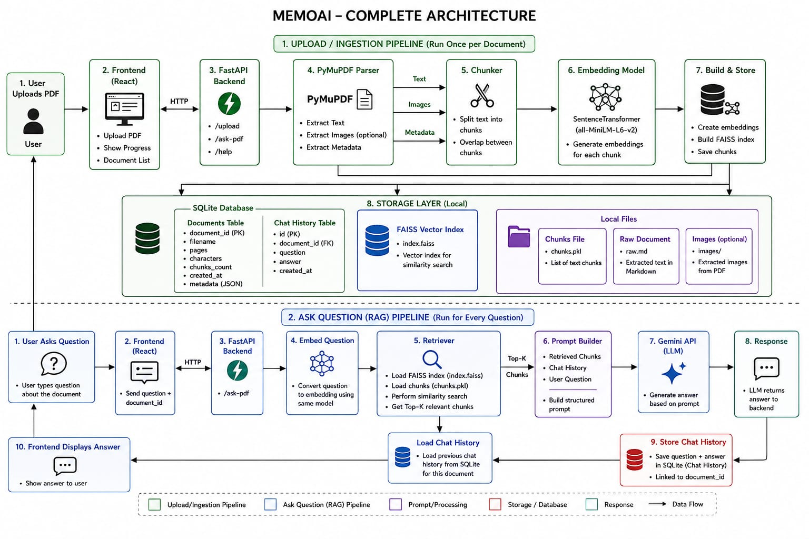

# MemoAI

## Architecture




# MemoAI

An AI-powered PDF Assistant built with FastAPI, Streamlit, RAG (Retrieval-Augmented Generation), FAISS, Sentence Transformers, and the Groq API.

Upload any PDF and ask natural language questions. MemoAI retrieves the most relevant sections of the document using semantic search before generating an accurate answer with an LLM.

---

## ✨ Features

- 📄 Upload PDF documents
- 💬 Ask questions about uploaded PDFs
- 🧠 Retrieval-Augmented Generation (RAG)
- 🔍 Semantic search using Sentence Transformers
- ⚡ Fast vector similarity search with FAISS
- 🤖 AI responses powered by Groq
- 🌐 FastAPI backend
- 🎨 Streamlit frontend
- 💭 Conversation history support

---

## 🛠 Tech Stack

- Python
- FastAPI
- Streamlit
- Groq API
- Sentence Transformers
- FAISS
- PyPDF
- Pydantic
- NumPy

---

## 📁 Project Structure

```
MemoAI/
│
├── app/
│   ├── core/
│   ├── db/
│   ├── models/
│   ├── rag/
│   ├── services/
│   └── main.py
│
├── frontend/
│   └── app.py
│
├── tests/
│
├── requirements.txt
├── .env
├── .gitignore
└── README.md
```

---

# Installation

## 1. Clone the repository

```bash
git clone https://github.com/YOUR_USERNAME/MemoAI.git
cd MemoAI
```

---

## 2. Create a virtual environment

Windows

```bash
python -m venv .venv
```

Activate it

Command Prompt

```bash
.venv\Scripts\activate
```

PowerShell

```powershell
.venv\Scripts\Activate.ps1
```

---

## 3. Install dependencies

```bash
pip install -r requirements.txt
```

---

## 4. Create a `.env` file

Inside the project root create a file named

```
.env
```

Add your Groq API key

```env
GROQ_API_KEY=your_api_key_here
```

---

## 5. Start the FastAPI backend

```bash
uvicorn app.main:app --reload
```

Backend will run at

```
http://127.0.0.1:8000
```

API documentation

```
http://127.0.0.1:8000/docs
```

---

## 6. Start the Streamlit frontend

Open a new terminal and run

```bash
streamlit run frontend/app.py
```

The application will open automatically in your browser.

---

# How it Works

```
PDF Upload
      │
      ▼
Extract Text
      │
      ▼
Character Overlap Chunking
      │
      ▼
Sentence Transformer Embeddings
      │
      ▼
FAISS Vector Index
      │
      ▼
Semantic Retrieval
      │
      ▼
Prompt Construction
      │
      ▼
Groq LLM
      │
      ▼
AI Response
```

---

## Future Improvements

- SQLite database
- Persistent vector database (ChromaDB)
- Multi-document support
- Source citations
- OCR for scanned PDFs
- Hybrid search (BM25 + Vector Search)
- Docker deployment
- Authentication

---

## Author

**Abdullah Shafiq**

BS Artificial Intelligence  
FAST National University of Computer and Emerging Sciences

GitHub: https://github.com/Abdullah-PyDev


